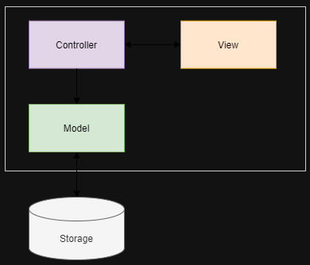

# MVC_EmailVerificationApp

In this repo, we explore using the MVC design pattern in building an email verification app using tkinter in python. Please enjoy!

### Software, Tools, and prerequisits

1. A trused programming IDE.
2. Basic python programing.
3. Basic Tkinter package knowledge.

### Intro To Model-View-Controller (MVC) Design Pattern

The MVC pattern allows the programmer to seperate concerns by dividing and application into three main components: model, view, and controller. This structure enables the code to be more maintainable by seperating focus for each of the components.

- **The Model**: this component is responsible for handeling the data/ state of the application. it typically sends and/or retrieves the data to/from the storage/ database. The model could have a bi-dirrectional connection to the Controller as it recieves commands from the controller oh how to handle the data.

- **The Controller**: this is the link between the Model and the View. it sends commands to update the state of the model based on actions from the View. it has a bi-directional connection to the View as it can also update the state of the view based on the model.

- **The View**: this is the component that faces the end user/ client. it is the user interface that represents the model as it has logic to display data. The view typically communicates with the controller directly.

### Intro To Model-View-Controller (MVC) Design Pattern

- **The Model Class**: Below are the steps to build the model.
  - The model class recieves the email data as input to the constructor.
  - Then uses getter and setter properties to get and set the email respectively.
    - The setter first uses regular expressions to check that the email provided matches a standard pattern.
    - if the pattern is correct, it sets the email variable correctly.
    - if the pattern is NOT correct, it throws a ValueError of an invalid email address.
- The model class also implements the logic to talk to the database (storage) by saving the provided email into a txt file. and also retrieving the first item in our list of saved emails.

- **The View Class**: Below are the steps to build the view.

  - The view extends the ttk.Frame module from the Tkinter module (frame houses all the GUI items sit in tkinter).
    - The label, the email entery, the save button, and the message (success or error)
  - Also implements the set controller feature. This is the connection between the controller and the view.
  - Implements the save button, retrieve button, and displays for success and error messages.

- **The Controller Class**: Below are the steps to build the controller.

  - The controller takes in both the view and the model.
  - It also implements the Save and Retrieve logic acting as the link between the View and the Model.

- **The Main App**: Below are the steps to implement the main app.

  - The main app instanciates the model, view, anc controller.
  - From the view, the Frame sits on top of the main Tkinter window.
  - From the model, the email is set and communicates with the database.
    This helps orgaize the app better.

###### Credits: https://www.pythontutorial.net/tkinter/tkinter-mvc/#:~:text=The%20MVC%20design%20pattern%20allows,especially%20when%20the%20application%20grows.
